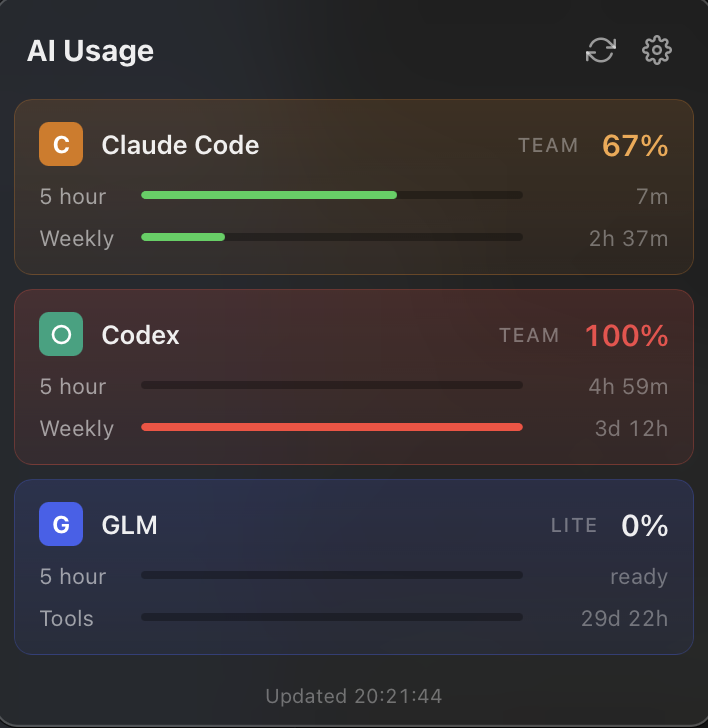

# AI Usage

A small macOS menu bar app showing how much of your AI coding limits you have used.
One icon, a percentage on hover, a click for the detail. Nothing else.

<p align="center">
  
</p>

---

## Why this exists

I built it for myself and figured other people might want it too.

[CodexBar](https://github.com/steipete/CodexBar) by Peter Steinberger is the
established tool here, it is very good, and it covers 69 providers. If you want
breadth, use that one: `brew install --cask steipete/tap/codexbar`.

I found it busier than I needed. This one supports three: **Claude Code**,
**Codex**, and **GLM** through ZCode. Each can be switched on or off in Settings,
so you see only the ones you use. If that is your setup too, you are welcome to it.

---

## What it does

- **Menu bar icon** with every provider's usage in the hover tooltip, and an optional countdown next to it
- **Click for a popover** with a bar per limit window, the used percentage, and a live reset countdown
- **Settings window** where each of the three providers can be switched on or off, plus general options
- **Notifications** when a provider crosses a threshold you choose
- **Launch at login**

Usage is shown as **used**, not remaining, so the bar fills and turns red as you approach the limit.

---

## Install

Requires macOS 14 or later. Universal binary, Apple Silicon and Intel.

```bash
curl -fsSL https://raw.githubusercontent.com/dhlotter/ai-usage/main/install.sh | bash
```

That downloads the latest release, verifies it against the checksum published
with that release, installs to `/Applications`, and starts it.

### If you would rather not pipe a script to bash

Fair. Read it first:

```bash
curl -fsSL https://raw.githubusercontent.com/dhlotter/ai-usage/main/install.sh -o install.sh
less install.sh
bash install.sh
```

Or skip it entirely and [build from source](#dev). Takes about a minute.

### Why a script and not a browser download

The app is ad-hoc signed rather than notarised, because an Apple Developer
account is $99 a year and this is free. macOS Gatekeeper enforces on the
`com.apple.quarantine` attribute, which browsers set and `curl` does not, so a
`.dmg` downloaded in Safari gets blocked while the same file fetched over the
terminal does not. Nothing here disables or bypasses a security feature, the file
is simply never quarantined, the same way every Homebrew formula install works.

The `.dmg` is on the [Releases](../../releases) page if you want it directly. You
will need to allow it under System Settings, Privacy & Security, after the first
launch attempt.

---

## What it accesses

Worth being specific, since this app reads credentials.

**It can reach exactly three network endpoints**, all of them the vendors' own APIs:

| | |
|---|---|
| `api.anthropic.com` | Claude Code usage |
| `chatgpt.com` | Codex usage |
| `api.z.ai` | GLM usage |

There is no telemetry, no analytics dependency, and nothing that phones home.
Grep the source and check: every URL in the codebase is in that table or a docs
link in the Settings window.

**Keys only ever travel inward.** The app can store a key and report whether one
exists, but never reads a stored key back out to the frontend, and passes it to
`security` over stdin rather than on the command line where it would show up in
the process list. Credential handling is all in
[`src-tauri/src/providers.rs`](src-tauri/src/providers.rs).

The whole thing is about 650 lines across the three core files. Small enough to
read over a coffee, which is a better reason to trust it than any signature.

---

## Providers

| Provider | Source | Credential | Windows shown |
|---|---|---|---|
| **Claude Code** | `api.anthropic.com/api/oauth/usage` | Keychain item Claude Code wrote (`Claude Code-credentials`) | 5-hour, weekly |
| **Codex** | `chatgpt.com/backend-api/wham/usage` | `~/.codex/auth.json` | 5-hour, weekly |
| **GLM** | `api.z.ai/api/monitor/usage/quota/limit` | Your Z.ai API key, in Settings | 5-hour |

### Why the credentials differ

These are not interchangeable auth methods, they are what each vendor allows.

Claude and Codex expose subscription limits only to their own CLI's stored credential.
Anthropic [banned third-party OAuth for subscription accounts in February 2026](https://alternativeto.net/news/2026/2/anthropic-officially-bans-using-subscription-authentication-for-third-party-claude-use),
and its API keys report organisation spend in dollars, which is a different measurement
entirely. So for those two, the app reads the credential the official CLI already stored.
Install and sign into the CLI once and they work with no further setup.

GLM is the opposite: ZCode's stored OAuth token is rejected by the quota endpoint, while a
normal Z.ai API key works. So GLM takes a key, entered in Settings and stored in the
Keychain as `ai-usage-glm`.

**These endpoints are undocumented.** They can change or be locked down without notice.

---

## Layout

```
src/
  main.tsx        Mounts App or Settings, chosen by window label
  App.tsx         Popover: the usage list
  Settings.tsx    Settings window: General and Providers
  shared.tsx      Types, provider table, settings storage, shared controls
  App.css         Palette and shared controls
  Settings.css    Settings window layout

src-tauri/src/
  lib.rs          Tray icon, popover positioning, settings window, autostart
  providers.rs    Fetching, caching, and API key storage
```

Both windows load the same bundle. `main.tsx` renders one or the other based on
`getCurrentWindow().label`. They keep separate React state and stay in sync over a
`settings-changed` Tauri event.

---

## Dev

```bash
npm install
npm run tauri dev
```

Run the tests:

```bash
cd src-tauri && cargo test
```

Build a universal release:

```bash
rustup target add x86_64-apple-darwin
npm run tauri build -- --target universal-apple-darwin
```

Output lands in `src-tauri/target/universal-apple-darwin/release/bundle/`.

---

## Notes

- Fetches run in parallel and start at launch rather than waiting for the webview.
  The popover also paints from the cache while the live fetch is still running, so
  rows fill in one at a time instead of the panel sitting blank until the slowest
  provider returns.
- Results are cached for 60s, with a 60s backoff on errors and a longer one when
  rate limited. Saving or clearing an API key clears that provider's cache so a
  correct key takes effect immediately.
- The tray icon is a template image, so macOS tints it for light and dark menu bars.

---

## Licence

[MIT](LICENSE). Do what you like with it: use it, fork it, ship it in something
you sell, no attribution ceremony required beyond keeping the licence notice.

It comes with no warranty. It reads undocumented endpoints that the vendors can
change at any time, so treat the numbers as a helpful indicator rather than
something to depend on.

Contributions are welcome, though I built this to scratch my own itch and intend
to keep it small. If you want the tool that covers everything, that is
[CodexBar](https://github.com/steipete/CodexBar).
